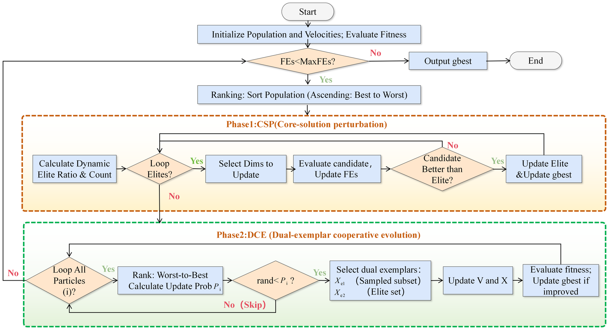
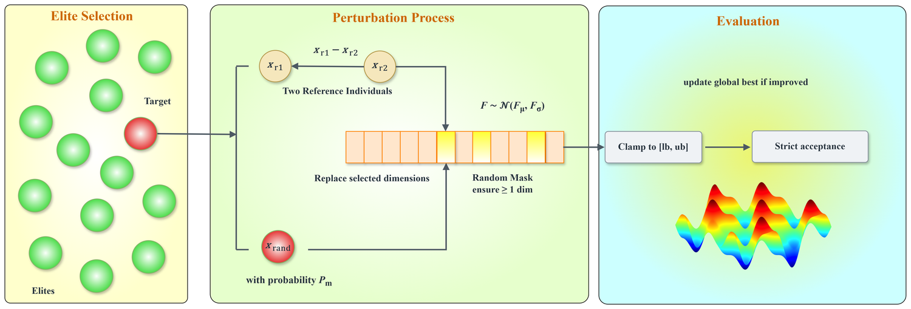
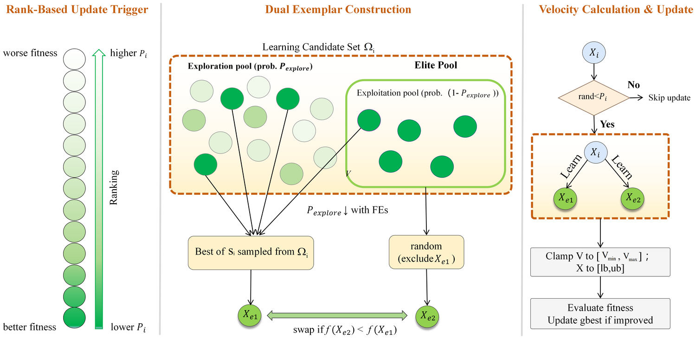
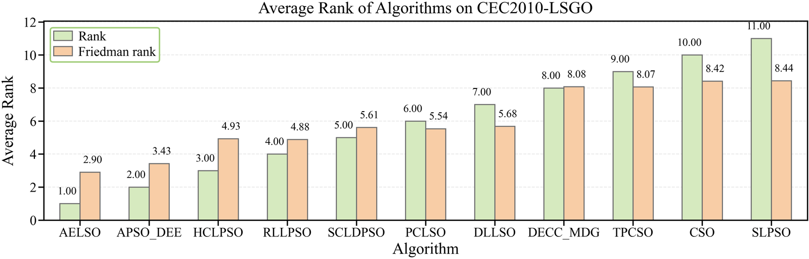
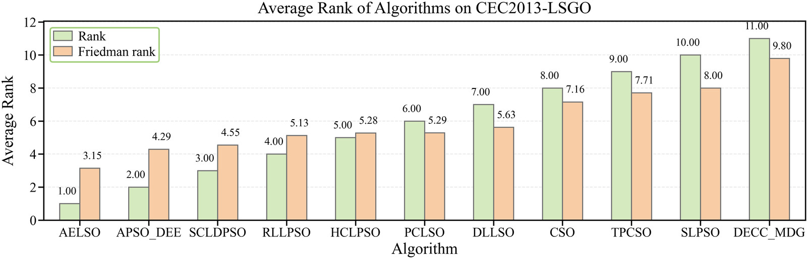

<div align="center">

<h1>AELSO</h1>

<p><b>Adaptive Equilibrium Learning Swarm Optimizer</b></p>

<p><i>Full-dimensional large-scale global optimization without variable decomposition</i></p>

<p>&nbsp;&nbsp;&nbsp;</p>

<p><b>English</b> &nbsp;·&nbsp; <a href="README.zh-CN.md">简体中文</a></p>

</div>

<br>

| | |
|:--|:--|
| **Manuscript** | AELSO: Adaptive Equilibrium Learning Swarm Optimizer for Large-Scale Global Optimization and Engineering Applications |
| **Authors** | Xiaolin Wang, **Qingke Zhang**\*, Guanghui Zhou, Lei Lyu, Junqing Li |
| **Affiliation** | <sup>1</sup> School of Computer Science and Artificial Intelligence, Shandong Normal University, Jinan 250358, China<br><sup>2</sup> School of Mathematics, Yunnan Normal University, Kunming 650500, China |
| **Corresponding author** | Prof. Qingke Zhang — [tsingke@sdnu.edu.cn](mailto:tsingke@sdnu.edu.cn) |

<br>

**Highlights**

- Full-dimensional large-scale optimization with no variable decomposition at any stage.
- Update activation and learning scope governed by budget progress and population quality rather than by fixed schedules.
- Refinement and propagation ordered inside one loop, so the two stages reinforce instead of compete.
- Best overall Friedman rank on both CEC'2010 and CEC'2013 (11 algorithms, 30 independent runs each).

<br>

## Contents

1. [Background and motivation](#1-background-and-motivation)
2. [Method overview](#2-method-overview)
3. [Key contributions](#3-key-contributions)
4. [Framework and mechanisms](#4-framework-and-mechanisms)
5. [Benchmark evaluation](#5-benchmark-evaluation)
6. [Application case studies](#6-application-case-studies)
7. [Reference implementation](#7-reference-implementation)
8. [How to cite](#8-how-to-cite)
9. [Funding and acknowledgments](#9-funding-and-acknowledgments)
10. [License and contact](#10-license-and-contact)

<br>

## 1. Background and motivation

Metaheuristics lose their footing as dimensionality climbs into the thousands. The reason is not a shortage of candidate solutions but a shortage of *information*: a fixed evaluation budget spreads thinner and thinner across the search space, so each new objective value tells the optimizer less about where to go next.

Under that pressure, population-based search faces a genuine dilemma. Concentrate on the few solutions that already look promising and the swarm converges to a local basin long before the budget runs out. Spread the learning broadly instead and the budget is consumed without any region ever being polished to completion.

A large part of the literature answers this by **decomposing** the problem — splitting the variables into groups and optimizing the groups separately. That works well when the grouping is accurate, but the grouping step itself is a hard problem, and a poor partition can cap the achievable solution quality no matter how good the underlying optimizer is.

AELSO takes the other branch. It keeps the search **full-dimensional** and attacks the dilemma from the opposite direction: rather than restructuring the problem, it regulates how reliable search information is produced and how far that information is allowed to travel through the population.

<br>

## 2. Method overview

AELSO runs two complementary mechanisms in sequence within every iteration and gives each of them a distinct job. The first squeezes extra precision out of the solutions that already lead the swarm. The second decides, individual by individual, who is entitled to learn, from whom, and how much — with the strictness of that decision relaxing or tightening as the evaluation budget is consumed. Refinement and redistribution therefore reinforce each other inside a single loop instead of competing for the same evaluations.

<br>

## 3. Key contributions

Three design choices separate AELSO from the usual large-scale toolkit.

**The update rule is driven by search state rather than by a fixed schedule.** Whether an individual is updated at all, and how far its learning sources are allowed to reach, are both decided from signals the run produces on its own: how much of the evaluation budget has been spent, and how the current population is distributed in quality. Update opportunities are steered toward the solutions that still need adjusting instead of being spread uniformly across the swarm.

**Refinement and propagation are ordered rather than merged.** Hybrid schemes usually let refinement and redistribution compete for the same evaluations. AELSO instead runs them in sequence inside every iteration: the elite is polished first, and the improved information is released into the population only afterwards. Refinement thereby becomes the input to propagation rather than its rival, and the ablation study reports that disabling either stage degrades overall performance — the two are complementary, not redundant.

**The framework stays decomposition-free by construction.** No variable grouping is ever built, so there is no partition to get wrong, no group count to choose, and no accuracy ceiling imposed by a poor split. The whole evaluation budget goes into search rather than into estimating a structure that the optimizer would then have to trust.

Taken together, the three points describe a single shift: the algorithm's behaviour is set by the search as it unfolds, and its two stages are arranged so that the gains from one become the working material of the other.

<br>

## 4. Framework and mechanisms

The overall control flow is shown below. After ranking the swarm, each iteration first applies the refinement mechanism and then the cooperative-evolution mechanism, before the budget check sends control back to the top.

<p align="center">
  
</p>

<p align="center">
  <em><b>Figure 1.</b> Overall control flow of AELSO. Ranking, elite refinement and cooperative evolution are interleaved inside one loop, with both phases drawing from the same evaluation budget.</em>
</p>

The two mechanisms are detailed separately below.

**Core-solution perturbation (CSP)** works only on the current elite set, and that set shrinks steadily as the run progresses. A candidate is produced by moving a *sparse* subset of dimensions — most coordinates are left untouched — and it replaces its parent only if it strictly improves on it. Sparsity keeps the elite's existing structure intact while allowing slow, low-risk gains; strict acceptance means the elite can never drift downhill. Figure 2a shows the sequence: elite selection, perturbation of the targeted dimensions, clamping to the search bounds, and acceptance.

**Dual-exemplar cooperative evolution (DCE)** then handles the rest of the swarm. Individuals are ranked from worst to best and the activation probability is set to fall as quality rises, so the solutions that still need adjustment are the ones revised most often; a small floor keeps every individual eligible, so none is frozen out entirely. When an update does fire, the individual draws on *two* exemplars rather than one — the best of a small randomly sampled subset, together with a second drawn at random from the elite pool — which keeps a single dominant attractor from swallowing the population. A separate exploration schedule governs whether a non-elite looks toward the leading edge of the swarm as a whole or restricts itself to the elite pool, and that schedule tightens as the budget is spent.

<p align="center">
  
  <br>
  <em><b>Figure 2a.</b> Core-solution perturbation. Only a sparse subset of dimensions is disturbed, and a candidate is retained only on strict improvement over its parent.</em>
</p>

<p align="center">
  
  <br>
  <em><b>Figure 2b.</b> Dual-exemplar cooperative evolution. Rank decides whether an update is triggered; the learning candidate set and the two exemplars are then assembled and the velocity is updated.</em>
</p>

<br>

## 5. Benchmark evaluation

AELSO was evaluated on the two standard large-scale suites under a single common protocol. All eleven algorithms — AELSO plus ten representative LSGO methods — received the same evaluation budget, the same dimensionality and the same number of independent runs, and the comparison was backed by Wilcoxon rank-sum tests together with a Friedman ranking over the whole suite.

| Suite | Functions | Dimension | Budget | Runs | AELSO Friedman rank | Runner-up |
|:--|:--:|:--:|:--:|:--:|:--:|:--|
| CEC'2010 LSGO | 20 | 1000 | 3 × 10⁶ FEs | 30 | **2.90 — 1st of 11** | APSO_DEE (3.43) |
| CEC'2013 LSGO | 15 | 1000 | 3 × 10⁶ FEs | 30 | **3.15 — 1st of 11** | APSO_DEE (4.29) |

AELSO takes the best overall Friedman rank on both suites. The margin is not built on a handful of easy functions: the pairwise significance tests put AELSO ahead of **every one of the ten competitors on both suites**, with more wins than losses against each of them — between 11 and 18 of the 20 CEC'2010 functions, and between 8 and 13 of the 15 CEC'2013 functions. Convergence and parameter-sensitivity studies accompany the comparison.

<p align="center">
  
  <br>
  <em><b>Figure 3a.</b> Function-wise average rank and overall Friedman rank on the CEC'2010 LSGO suite. AELSO attains the lowest Friedman rank of the eleven algorithms.</em>
</p>

<p align="center">
  
  <br>
  <em><b>Figure 3b.</b> The same ranking analysis on the CEC'2013 LSGO suite, where AELSO again obtains the best overall Friedman rank.</em>
</p>

<br>

## 6. Application case studies

Benchmark suites measure solution quality, not whether an optimizer survives contact with a real model. AELSO was therefore embedded into two application problems whose decision structures differ substantially from each other.

**Profile hidden Markov model fitting for sequence alignment.** Here the optimizer searches the transition and emission parameters of the model; each candidate vector is decoded into a valid parameter set, and alignment quality is scored through Viterbi inference. The search space is continuous after encoding but the objective is defined through a discrete decoding procedure, so the optimizer must cope with a noisy, non-separable response surface.

**Kapur-entropy multilevel thresholding for image segmentation.** Here each candidate is an ascending vector of gray-level thresholds, repaired to feasibility and scored by Kapur entropy over the image histogram. The difficulty grows with the threshold count, and the objective becomes progressively more rugged as more thresholds are admitted.

Both applications were run under a fixed protocol with repeated independent trials, and segmentation quality was additionally assessed with standard image-quality indices (PSNR, MSE, MAE, SSIM and FSIM). The takeaway is deliberately scoped: the experiments establish that AELSO can be *embedded* into these two distinct black-box models and produce stable, usable results — not that it dominates every specialized solver in either domain.

<p align="center">
  
  <br>
  <em><b>Figure 4.</b> Kapur-entropy multilevel thresholding of the Cameraman test image. As the threshold count K grows from 2 to 100, the segmentation retains progressively finer gray-level structure, matching the reported gains in objective entropy and image-quality indices.</em>
</p>

<br>

## 7. Reference implementation

The reference implementation is a single self-contained MATLAB function. It has no external dependencies beyond the objective function handle supplied by the caller, and it reproduces the CEC'2010 / CEC'2013 configuration reported in the manuscript.

```matlab
% Caller supplies the objective handle and the problem definition.
% MaxFEs and the population size are pinned inside the file to the
% benchmark configuration used in the paper.
[gbestX, gbestfitness, gbesthistory] = AELSO( ...
    [], 1200, 1000, 100, -100, 0.2*100, -0.2*100, ...
    [], @myObjective, 1, false);
```

<details>
<summary><b>Click to expand the full <code>AELSO.m</code> source (with inline documentation)</b></summary>

<br>

```matlab
function [gbestX, gbestfitness, gbesthistory] = AELSO(mainHandle, PopSize, D, xmax, xmin, vmax, vmin, MaxIter, fCalculation, FuncId, VisualSwitch)
% =========================================================================
%  AELSO -- Adaptive Equilibrium Learning Swarm Optimizer
%
%  Reference implementation of the algorithm described in:
%    "AELSO: Adaptive Equilibrium Learning Swarm Optimizer for Large-Scale
%     Global Optimization and Engineering Applications"
%
%  Copyright (c) 2026  Qingke Zhang, Xiaolin Wang
%  School of Computer Science and Artificial Intelligence
%  Shandong Normal University, Jinan 250358, China
%
%  Released under the MIT License. See the LICENSE file in the repository
%  root for the full text. If you use this code in academic work, please
%  cite the paper above (see also CITATION.cff).
%
%  Version : V10.0
%  Updated : 2025-09-29
%
% -------------------------------------------------------------------------
%  Input arguments
%    mainHandle    - reserved handle for an external driver (currently unused)
%    PopSize       - population size. NOTE: overridden below, see "Design note"
%    D             - problem dimensionality
%    xmax, xmin    - upper / lower bounds on the decision variables; scalar or
%                    1-by-D vectors
%    vmax, vmin    - upper / lower bounds on the velocity; scalar or 1-by-D
%    MaxIter       - reserved iteration cap (currently unused; the loop is
%                    governed by MaxFEs, see "Design note")
%    fCalculation  - function handle of the objective, called as f(x, FuncId)
%    FuncId        - numeric identifier forwarded to fCalculation
%    VisualSwitch  - reserved display flag (currently unused)
%
%  Output arguments
%    gbestX        - best solution found, 1-by-D
%    gbestfitness  - objective value of gbestX
%    gbesthistory  - 1-by-MaxFEs record of the best-so-far objective value
%
% -------------------------------------------------------------------------
%  Design note on the fixed budget and population size
%    MaxFEs is fixed to 3e6 and PopSize is fixed to 1200 below so that the
%    file reproduces the CEC'2010 / CEC'2013 LSGO configuration reported in
%    the paper without any external setup. To reuse the optimizer on a
%    different budget or population, comment out the two hard-coded lines in
%    the parameter block and pass the values through the argument list.
% =========================================================================

%% ------------------------------------------------------------------------
%  Algorithm-level parameters
%  The defaults below form the "general-purpose robust" configuration used in
%  the paper and can be re-tuned for a specific problem.
% -------------------------------------------------------------------------

% --- Overrides that pin the benchmark configuration ----------------------
PopSize = 1200;                  % forces the paper's population size
MaxFEs  = 3 * 10^6;              % evaluation budget for the benchmark runs

% --- DCE (Dual-exemplar cooperative evolution) parameters ----------------
NP_max    = PopSize;
% NP_min = round(0.1 * NP_max);  % removed: the population is never shrunk
beta_mean = 0.4;                 % mean of the DCE inertia coefficient
beta_std  = 0.01;                % std  of the DCE inertia coefficient
TS_range  = [2, 6];              % range of the sampled exemplar-pool size

% --- CSP (Core-solution perturbation) parameters -------------------------
ratio_max     = 0.2;             % elite ratio at the start of a run
ratio_min     = 0.05;            % elite ratio at the end of a run
N_GT_per_elite = 1;              % perturbation trials per elite
Pj_mean       = 0.01;            % mean of the per-dimension mutation rate
Pj_std        = 0.01;            % std  of the per-dimension mutation rate
Pm            = 0.01;            % probability of drawing a random component
F_mean        = 0.5;             % mean of the difference-vector scale factor
F_std         = 0.1;             % std  of the difference-vector scale factor

% --- AELSO control parameters --------------------------------------------
epsilon = 1e-4;                  % floor on the update probability, keeps a
                                 % small escape chance for every individual
P_start = 0.8;                   % exploration probability at the start
P_end   = 0.2;                   % exploration probability at the end

% --- Framework-level settings --------------------------------------------
Fitness        = fCalculation;
FEs            = 0;
print_interval = floor(MaxFEs / 10);   % progress report every 10% of budget

% Expand scalar bounds into full vectors so the vectorised updates below work
if isscalar(xmin); xmin = repmat(xmin, 1, D); end
if isscalar(xmax); xmax = repmat(xmax, 1, D); end
if isscalar(vmin); vmin = repmat(vmin, 1, D); end
if isscalar(vmax); vmax = repmat(vmax, 1, D); end

%% Step 1 -- population initialisation
% Positions and velocities are drawn uniformly inside the box; every initial
% individual costs one function evaluation.

X = zeros(NP_max, D);
V = zeros(NP_max, D);
f = zeros(NP_max, 1);

for i = 1:NP_max
    X(i, :) = xmin + (xmax - xmin) .* rand(1, D);
    V(i, :) = vmin + (vmax - vmin) .* rand(1, D);
    f(i)    = Fitness(X(i, :)', FuncId);
end
FEs = FEs + NP_max;

[gbestfitness, gbest_idx] = min(f);
gbestX       = X(gbest_idx, :);
gbesthistory = inf(1, MaxFEs);
gbesthistory(1:FEs) = gbestfitness;

%% Step 2 -- main loop
% Each iteration runs the two mechanisms back to back: first CSP refines the
% elites, then DCE redistributes the learned information across the swarm.
while FEs < MaxFEs

    % Rank the swarm from best to worst before either mechanism runs
    [f_sorted_val, sorted_idx] = sort(f, 'ascend');
    X_sorted = X(sorted_idx, :);
    V_sorted = V(sorted_idx, :);

    % ---------------------------------------------------------------------
    % Part 1: CSP -- core-solution perturbation
    % The elite ratio decays with the square root of the consumed budget, so
    % the effort spent on refinement shrinks as the search matures.
    % ---------------------------------------------------------------------
    current_elite_ratio = ratio_max - (ratio_max - ratio_min) * (FEs / MaxFEs)^0.5;
    num_elites          = max(2, floor(NP_max * current_elite_ratio));

    for i = 1:num_elites
        if FEs >= MaxFEs; break; end

        elite_particle_X = X_sorted(i, :);
        elite_particle_f = f_sorted_val(i);

        for gt_iter = 1:N_GT_per_elite
            if FEs >= MaxFEs; break; end

            % Sparsely pick the dimensions that are allowed to move; at least
            % one dimension is forced so the candidate never equals the elite
            selected_dims_idx = rand(1, D) < abs(normrnd(Pj_mean, Pj_std));
            if ~any(selected_dims_idx); selected_dims_idx(randi(D)) = true; end

            % Two reference individuals are drawn from the elite set; if the
            % elite set is too small, the whole swarm is used as the pool
            v_best = zeros(1, D);
            elite_indices = 1:num_elites;
            available_ref_indices = setdiff(elite_indices, i);
            if length(available_ref_indices) < 2
                all_indices_sorted = 1:NP_max;
                available_ref_indices = setdiff(all_indices_sorted, i);
            end

            ref_indices_in_sorted = available_ref_indices(randperm(length(available_ref_indices), 2));

            xr1 = X_sorted(ref_indices_in_sorted(1), :);
            xr2 = X_sorted(ref_indices_in_sorted(2), :);
            F   = normrnd(F_mean, F_std);

            % Base difference vector, with a small chance of swapping one
            % component for a fresh random value inside the box
            for j = 1:D
                if rand < Pm
                    x_rand_j = xmin(j) + (xmax(j) - xmin(j)) * rand;
                    v_best(j) = elite_particle_X(j) + F * (xr1(j) - x_rand_j);
                else
                    v_best(j) = elite_particle_X(j) + F * (xr1(j) - xr2(j));
                end
            end
            v_best = max(min(v_best, xmax), xmin);      % clamp to the box

            % Only the sparsely selected dimensions are actually replaced
            candidate_X = elite_particle_X;
            candidate_X(selected_dims_idx) = v_best(selected_dims_idx);

            FEs = FEs + 1;
            if FEs > MaxFEs; break; end
            candidate_f = Fitness(candidate_X', FuncId);

            % Strict acceptance: the elite is replaced only on improvement
            if candidate_f < elite_particle_f
                elite_particle_X = candidate_X;
                elite_particle_f = candidate_f;
            end

            if candidate_f < gbestfitness
                gbestfitness = candidate_f;
                gbestX       = candidate_X;
            end
            gbesthistory(FEs) = gbestfitness;

            if mod(FEs, print_interval) == 0 && print_interval > 0
                fprintf('AELSO: FEs = %d, best fitness = %e\n', FEs, gbestfitness);
            end
        end

        X_sorted(i, :) = elite_particle_X;
        f_sorted_val(i) = elite_particle_f;
    end

    % Write the improved elites back into the swarm
    X(sorted_idx, :) = X_sorted;
    V(sorted_idx, :) = V_sorted;
    f(sorted_idx)    = f_sorted_val;

    % ---------------------------------------------------------------------
    % Part 2: DCE -- dual-exemplar cooperative evolution
    % Every individual is considered once per iteration, from the worst to
    % the best, and the activation probability grows with its rank.
    % ---------------------------------------------------------------------
    [~, worst_to_best_idx] = sort(f, 'descend');

    P_explore = P_start - (P_start - P_end) * (FEs / MaxFEs);

    % Rank weights follow a discretised Gaussian profile; the worst
    % individual keeps the floor probability epsilon instead of zero
    ranks_descend = 1:NP_max;
    W_all = (1 / (sqrt(2*pi) * NP_max)) * exp(-((ranks_descend-1).^2) / (2 * NP_max^2));
    W_min = min(W_all); W_max = max(W_all);

    for i = 1:NP_max
        if FEs >= MaxFEs; break; end

        current_particle_original_idx = worst_to_best_idx(i);
        rank_i = i;

        W_i = W_all(rank_i);
        if W_max == W_min; P_i_raw = 1; else; P_i_raw = (W_i - W_min) / (W_max - W_min); end
        P_i = epsilon + (1 - epsilon) * P_i_raw;

        if rand < P_i
            % --- Assemble the learning candidate set Omega_i --------------
            elite_original_indices = sorted_idx(1:num_elites);
            is_elite = ismember(current_particle_original_idx, elite_original_indices);

            if is_elite
                % An elite learns only from strictly better individuals
                [~, current_rank_ascend] = ismember(current_particle_original_idx, sorted_idx);
                if current_rank_ascend == 1; continue; end
                learning_pool_indices = sorted_idx(1:current_rank_ascend-1);
            else
                % A non-elite either explores the better part of the swarm
                % or exploits the elite set, depending on the schedule
                if rand < P_explore
                    [~, current_rank_ascend] = ismember(current_particle_original_idx, sorted_idx);
                    learning_pool_indices = sorted_idx(1:current_rank_ascend-1);
                else
                    learning_pool_indices = elite_original_indices;
                end
            end

            if length(learning_pool_indices) < 2; continue; end

            % --- Xe1: best of a randomly sampled candidate subset ---------
            subset_size = randi(TS_range);
            if length(learning_pool_indices) < subset_size; continue; end
            subset_cand_indices = learning_pool_indices(randperm(length(learning_pool_indices), subset_size));
            [~, best_local_idx] = min(f(subset_cand_indices));
            Xe1_original_idx = subset_cand_indices(best_local_idx);

            % --- Xe2: a random elite, different from Xe1 ------------------
            pool_for_Xe2 = setdiff(elite_original_indices, Xe1_original_idx);
            if isempty(pool_for_Xe2)
                % Fall back to the learning pool when no other elite exists
                pool_for_Xe2 = setdiff(learning_pool_indices, Xe1_original_idx);
                if isempty(pool_for_Xe2); continue; end
            end
            Xe2_original_idx = pool_for_Xe2(randi(length(pool_for_Xe2)));

            % --- Velocity and position update -----------------------------
            Xe1 = X(Xe1_original_idx, :);
            Xe2 = X(Xe2_original_idx, :);

            % Guarantee that Xe1 is the stronger of the two exemplars
            if f(Xe2_original_idx) < f(Xe1_original_idx)
                [Xe1, Xe2] = deal(Xe2, Xe1);
            end

            beta = max(0, min(1, normrnd(beta_mean, beta_std)));
            R1 = rand(1, D); R2 = rand(1, D); R3 = rand(1, D);

            V(current_particle_original_idx, :) = R1 .* V(current_particle_original_idx, :) ...
                + R2 .* (Xe1 - X(current_particle_original_idx, :)) ...
                + beta .* R3 .* (Xe2 - X(current_particle_original_idx, :));
            V(current_particle_original_idx, :) = max(min(V(current_particle_original_idx, :), vmax), vmin);
            X(current_particle_original_idx, :) = X(current_particle_original_idx, :) + V(current_particle_original_idx, :);
            X(current_particle_original_idx, :) = max(min(X(current_particle_original_idx, :), xmax), xmin);

            FEs = FEs + 1;
            if FEs > MaxFEs; break; end
            f(current_particle_original_idx) = Fitness(X(current_particle_original_idx, :)', FuncId);

            if f(current_particle_original_idx) < gbestfitness
                gbestfitness = f(current_particle_original_idx);
                gbestX       = X(current_particle_original_idx, :);
            end
            gbesthistory(FEs) = gbestfitness;

            if mod(FEs, print_interval) == 0 && print_interval > 0
                fprintf('AELSO: FEs = %d, best fitness = %e\n', FEs, gbestfitness);
            end
        end
    end
end

%% Step 3 -- align the recorded history with the exact evaluation budget
% The loop can overshoot or undershoot the budget by a fraction of one
% iteration; pad or truncate so that gbesthistory is exactly MaxFEs long.
if FEs < MaxFEs
    gbesthistory(FEs+1:MaxFEs) = gbestfitness;
elseif FEs > MaxFEs
    gbesthistory(MaxFEs+1:end) = [];
end

end
```

</details>

<br>

## 8. How to cite

If AELSO is useful in your research, please cite this work:

```bibtex
@misc{wang2026aelso,
  title        = {AELSO: Adaptive Equilibrium Learning Swarm Optimizer for
                  Large-Scale Global Optimization and Engineering Applications},
  author       = {Wang, Xiaolin and Zhang, Qingke and Zhou, Guanghui and
                  Lyu, Lei and Li, Junqing},
  year         = {2026},
  howpublished = {Reference implementation and project documentation},
  url          = {https://github.com/tsingke/AELSO}
}
```

A machine-readable [`CITATION.cff`](CITATION.cff) is included in this repository.

<br>

## 9. Funding and acknowledgments

This work is supported by the National Natural Science Foundation of China (Grant No. 62006144).

<br>

## 10. License and contact

The implementation is released under the [MIT License](LICENSE). The figures in `figures/` are provided here for illustration; please cite the work when referring to them. See [NOTICE.md](NOTICE.md) for the terms that apply to the code and the figures.

Questions about the algorithm, the experiments, or the code are welcome at **[tsingke@sdnu.edu.cn](mailto:tsingke@sdnu.edu.cn)**.

<br>

<div align="center">
<sub>School of Computer Science and Artificial Intelligence, Shandong Normal University</sub>
</div>
